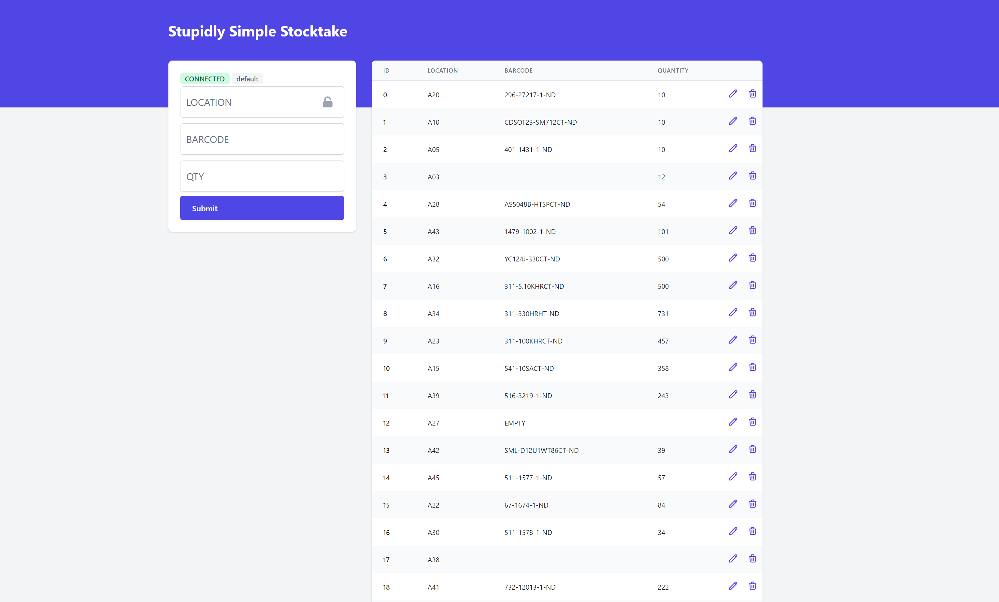

# A Stupidly Simple Stocktake System
If you have a barcode scanner and just need to quickly inventory some stuff, or if you want to maintain a small database of things then this will probably get the job done. Its incredibly simple and has a few nifty things too.



**Why use this?** Tbh, you probably won't want to. But if you need something simple, then this will work. Alternativly its a good starting point for your own customizations, that can take to much effort on larger, more complete systems.

## Getting started
1. Clone the repo
2. Build the frontend: `cd kisst-app && npm ci && npm run build`
3. Delete the sample database. Just delete the `database.json` file
4. Start the server: `npm run server`

## Nifty Features
### Enter to progress feilds
Pressing enter will move you to the next input feild. Works like a charm with most barcode scanners.

### Locking Feild Locking
When moving alot of stock into one location, you can lock the location feild to only cycle between barcode and quantity.

Just click the padlock icon.


### Edit
A simple edit interface. 

**Note** There is a bug with this on larger databases.


### Multiple databases
Want to have segregation between databases? Go to `<ip>/database_name` to automatically create a new database with the name `database_name`. This feature is a little buggy, but gets the job done.

### Auto-retry server status
Backend is a websocket server. If it goes down for some reason, it'll try to recover.


## How it works. TLDR
The code is a mess (it was built pretty quickly). The `kisst-app` folder contains the frontend. Its written in Vue. Web-sockets join the frontend to the backend with live support for multiple users. 

The backend is the `app.js` file. It uses a simple in-file database that saves every second if theres been a change. This is the `database.json` file. You would probably want to post-process this file afterwards to get it into some usable form.

```json
{
    "database": {
        "default": {
            "data": [
                { "id": 0, "location": "A20", "barcode": "296-27217-1-ND", "qty" : "10" },
                { "id": 1, "location": "A10", "barcode": "CDSOT23-SM712CT-ND", "qty" : "10" },
                { "id": 2, "location": "A05", "barcode": "401-1431-1-ND", "qty" : "10" },
            ]
        }
    }
}
```
